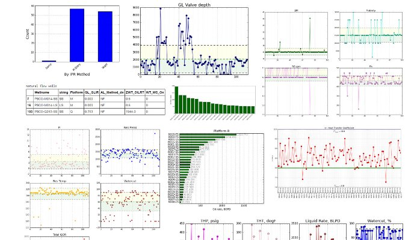
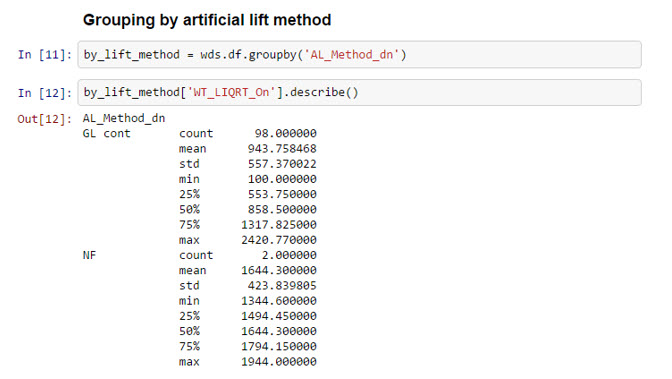
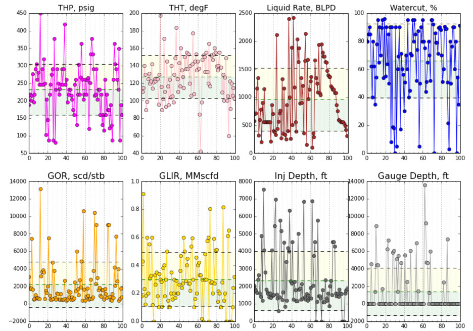

## Part 1: Data Science for Petroleum Production Engineering

In the last century, the production engineer built the well models one by one and analyzed the results also one by one. With the ubiquity of the personal computer, desktops and laptops, an unimaginable computational power has been put in our hands. But we need the right tools!

### The Old vs the New

_Why -if we communicate data at gigabits per second-, are we still using a tool of the era of bits per second?_

The spreadsheet was invented in the 80’s and was a great invention. The beauty of it is that you can produce results right away. We are very thankful to Lotus 1-2-3 and Microsoft Excel for that. But let us remember that it was the 80’s –there was not internet, no tablets, data moved at 2400 bps, and real-time data acquisition was constrained to a handful of fields. Today, well data comes in gigabytes per minute and we know it is not humanly possible to tackle all the information to put it at good use.

The answer of this century is to that is start using automation, artificial intelligence, statistics, machine learning but first of all, data science. These are the keywords of the future. The future of the petroleum engineer.

### Why does it take so long to build optimization models?

One of the things that always intrigued the production managers what is it that takes so long to build well models and a network models? One of the causes is that we have to enter the data manually; we have to double and triple check the data we are entering, calibrate and match the model; and – the most important of all-, we do enter the data without a context. What does that mean? It means we work on a well model in isolation without having the tools to validate our well data in the context of the field data or of other wells data (neighbors). Then when we have all our 77 or 177 wells ready, we received fresh well test data that contradicts earlier well tests! Go back to rework some models.

Part of this conundrum is not the production engineer’s fault; it is just the way that well optimization software works or has been built: to attack a well one at a time and disconnected from the test data source.

At Petronas we have been using for a while Python scripts to help to address the problem of single well modeling in a radical different way: by building well models with multiwell scanning, validation and analysis. With these techniques the engineer minimizes the manual data entering, validation, calibration and data qualification. This by itself represents a major advantage over the traditional way of doing well and network modeling. The additional power and discovery of oil gains from production optimization comes from applying basic statistics to the results or the calculations or simulation runs. 

The plots that you see in this post are just few samples of the work of well and network modeling on a field. I have changed names and numbers to make the exercise neutral.

None of this is earth shattering new; it has been around for years but the digital tools that are making technology companies successful are taking time to take off in the production engineering field. Well, first, data science is hard. But enormously gratifying when you find hidden oil.

### Data Structures are our friends

One of the keys in data science is to get accustomed to analyze well production data by using dynamic tables. There is no best tool for analyzing production engineering data than Python Pandas. The *pandas* tables (yes, it is written in lowercase) are a magnificent object to manipulate, arrange, organize, calculate, clean, select, filter, analyze and plotting our production data. We created the *Petronas PTech Engineering Library* that includes dozens of scripts that make use of *pandas* and other Pythons packages such as numpy, scipy, matplotlib, PyQt4, pyqtgraph, bokeh, traits, etc.  With the help of the libraries the engineer is able to analyze the well model data faster and in a more reliably way since all these tasks are done by algorithms written in Python, the world’s leading scripting language for scientists and engineers. And, it is open source.

Your are curious? This is how a simple statement looks like.

From the data we can say that the biggest producers are wells producing by gas lift with an average of 944 blpd (barrels of liquid per day), a maximum of 2421 blpd in a total of 98 wells. The lowest producer is at 100 blpd.

### Remember Garbage In, Garbage Out

 In next posts I will be showing simple Python and pandas scripts for petroleum production engineering. What we see in the next plot is a plotting technique for quality control of the well test data to be used in the well models. Before we run the models it is recommended that you run some scripts to qualify the data such as finding outliers or data points that do not belong there. 

### The Python notebooks are a fit for production engineers

The Python notebooks look ideal for the application of data science to well, network modeling and production optimization. There are many ways of running Python but I find the notebook the best method to transmit knowledge and share solutions with colleagues. The Python notebooks -lately renamed as *Jupyter* -, are widely known in the engineering community. You shouldn’t have any trouble finding assistance online. The same applies to Python. My favorite is *stackoverflow.com*. There are hundreds of engineering and scientific libraries around that will help to makes your production engineering job more efficient, accurate, profitable and fun.

The Python notebook opens in a browser but if you want to make long and advanced scripts for petroleum engineering, there are plenty of good development applications or IDEs out there: Spyder, PyCharm and Eclipse, just to mention a few.

